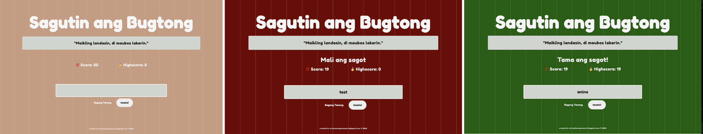

# 🕹 Filipino Riddle Game JavaScript Project

Riddle game specifically about Filipino riddles ("bugtong") prompts one question at a time. The current score will be deducted everytime the answer is wrong.

## Tech Stack
`HTML 5`,  `SASS`, `JavaScript`
## App Screens

 
## Run Locally

Install dependencies (this will install `sass` and `live-server`)

```bash
  npm install
```

Start the server

```bash
  npm run start
```

## License

> Read license [here](LICENSE.txt)

